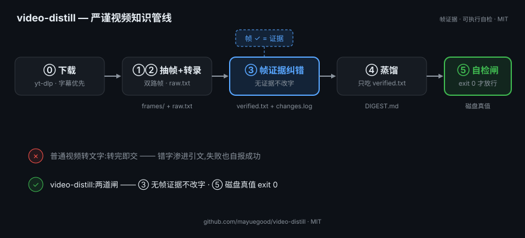

# video-distill

[简体中文](README.md) | **English**

> Turn any video into trustworthy, citable knowledge — with frame-level evidence for every correction.

<p align="center"></p>

**Turn any video into trustworthy, citable knowledge — with frame-level evidence for every correction.**

A [skill](https://github.com/anthropics/skills) for AI coding agents (Claude Code, ZCode, and anything that reads `SKILL.md`): dual-track frame extraction → transcription → **frame-evidence correction** → distillation. Every text change is traceable to a specific video frame; every deliverable passes an executable self-check before it can be called "done".

> 核心理念：**转录必有错，无证据不改字。** Speech-to-text errors (homophones, mangled proper nouns) can never be verified by re-listening — the video's own frames (slides, subtitles, on-screen text) are the only physical evidence. This pipeline makes every correction auditable and every completion claim verifiable.

English docs · 中文说明见下方

---

## Why this exists

Typical "video → notes" pipelines produce plausible text with silent errors baked in. Worse, the agent *claims* completion based on its own self-report — and nobody checks the artifacts on disk.

video-distill enforces two discipline layers:

1. **Evidence-based correction** — a transcription change is only allowed with a frame reference (`原文 → 改后 | 证据=scene113.jpg`). Unverifiable guesses stay in the text tagged `[UNVERIFIED]`.
2. **Executable self-check** — `verify-output.sh` verifies real artifacts on disk (not "the agent said it finished"). Exit 0 or it's not done. This was born from a real incident: a batch job reported success, but the output was never written to disk.

---

## Use cases / 适用场景

凡是"视频里的内容,之后要被**引用、汇总、拿来做决定**"的场景——都适用。

| 场景 | 为什么需要帧证据 |
|---|---|
| **讲座 / 播客 → 笔记** | 口播术语被转错(如 "Harnes"→"Harness")，帧里的 slide 写法才是标准写法 |
| **教程视频 → 操作手册** | 命令行参数、文件名（`SOUL.md` vs `sore.md`）只有画面能锁定，听永远分不清 |
| **会议录像 → 决议纪要** | "预算 300 万"错成 30 万是要出事的——板书 / PPT 是物证 |
| **批量视频处理** | 逐条人工校对不现实；可审计的自动化 = 每处改动有帧作证，抽查即可放行 |
| **采访 / 对谈 → 引文引用** | 引文可信度靠 changes.log 背书，敢直接引用 |
| **多语言视频（繁转简）** | Whisper 中文输出常带繁体 + 同音字，逐句转换最容易顺手改错 |

**不适用**：纯音乐 MV、画面无文字且术语密度低的闲聊视频（帧证据没东西可锚）、实时直播。

## Requirements / 依赖工具

| 工具 | 用在哪 | 必需？ | 获取 |
|---|---|---|---|
| **ffmpeg** | 双路抽帧（固定间隔 + 场景切换）、音频提取 | ✅ 必需 | `brew install ffmpeg` / [ffmpeg.org](https://ffmpeg.org) |
| **yt-dlp** | ⓪ 下载（YouTube / B站 / 抖音等）、探测字幕轨 | ✅ 必需 | `brew install yt-dlp` / [yt-dlp.org](https://github.com/yt-dlp/yt-dlp) |
| **whisper.cpp** 的 `whisper` CLI | ② 转录（或任何兼容 `--model/--output_format` 的实现） | 转录必需（字幕预放路线可跳过） | [ggml-whisper/whisper.cpp](https://github.com/ggml-whisper/whisper.cpp) |
| **Python 3** | extract.sh 内部（帧时间戳对齐） | ✅ 必需 | 系统自带或 [python.org](https://www.python.org) |
| **多模态图像理解** | ③ 读帧证据（如 Claude / GPT-4V / Gemini 的视觉能力，或本地 VLM） | 纠错必需（无则人工看帧） | 随你的 agent |
| **jq / gh CLI**（可选） | 本仓库贡献者跑 CI 与示例 | 可选 | `brew install gh` |

> **16GB 内存机器**：whisper 用默认 `small` 模型即可，且务必串行跑、`nice -n 15` 降权（详见 SKILL.md 本机负载纪律）。

## What's inside

```
video-distill/
├── SKILL.md                      # Entry point: routing + pipeline rules (read this first)
├── scripts/
│   ├── extract.sh                # ①② ffmpeg dual-track frames + Whisper transcription
│   └── verify-output.sh          # ⑤ Executable self-check (12 checks, exit 0 = done)
└── references/
    ├── verify-protocol.md        # ③ Frame-evidence correction protocol + subagent template
    ├── distill.md                # ④ Distillation rules (input MUST be verified.txt)
    └── download.md               # ⓪ Download strategies + copyright boundary
```

## Pipeline

```
⓪ Download          yt-dlp (YouTube/Bilibili/…) — prefer official subtitle tracks as ground truth
①② Extract          extract.sh → frames/tick*.jpg + frames/scene*.jpg + transcript/raw.{txt,srt}
③ Correct           read frames as evidence → verified.txt + changes.log (every change cites a frame)
④ Distill           verified.txt (NEVER raw.txt) → DIGEST.md
⑤ Self-check        verify-output.sh → exit 0, or it's not done
```

**Why dual-track frame extraction:** speech-heavy videos rarely trigger scene changes (observed: 2 scene cuts in a 4-min talk), so scene detection alone gives too little evidence. Fixed-interval ticks guarantee coverage; scene frames add density where it matters. Filenames embed the second offset, aligning directly with the SRT timeline.

## Install

**Requirements:** `ffmpeg`, `yt-dlp`, Python 3, and [whisper.cpp](https://github.com/ggml-whisper/whisper.cpp)'s `whisper` CLI (or any compatible CLI with `--model/--output_format` flags). macOS/Linux. 16GB RAM machines: use the default `small` model and keep transcriptions serial.

```bash
git clone https://github.com/<you>/video-distill ~/.agents/skills/video-distill
```

That's it — agents discover the skill via `SKILL.md`. To verify an existing run:

```bash
bash ~/.agents/skills/video-distill/scripts/verify-output.sh <output_dir>
```

## The self-check (prove-it-works)

`verify-output.sh` runs 12 hard checks across three layers and is wired into the pipeline itself — extraction auto-runs it (stage mode), the correction protocol requires the parent agent to re-run it in full mode (a subagent's self-report doesn't count), and distillation ends with a full re-run as the final gate.

| Layer | Checks | Catches |
|---|---|---|
| Extract | frames exist / raw.txt+srt non-empty / readable / size scales with video length | "extract said it finished" but nothing landed on disk |
| Correct | verified.txt+changes.log exist / every change cites evidence / stats block / size ratio (route-aware) | missing evidence, silent mass deletion |
| Distill | DIGEST non-empty + source attribution | hollow deliverables |

Known boundary: the size-ratio check flags, it doesn't convict — subtitle-route transcripts get restructured (observed 38% is normal), so a FAIL there means "run the keyword spot-check", not "content is lost".

## Usage sketch

Tell your agent: *"处理这个视频 https://… / distill this video"* — the SKILL.md routing table picks the entry point (local file / WeChat-Channel link / normal URL / existing transcript / existing verified.txt). Or run layers manually — every script is standalone.

## Design notes

- **Correct, not rewrite**: the correction layer never touches word order, deletes sentences, or "improves" phrasing. 校对不是改写。
- **Route-aware thresholds**: subtitle-route raw transcripts are line-stacked (redundant) while Whisper-route ones are dense — size checks adapt accordingly.
- **Keep the unfixed visible**: uncorrectable suspicious words stay tagged `[UNVERIFIED: 疑似应为XX]` rather than being "helpfully" fixed.

## Credits & Prior Art

- **[pstack](https://github.com/cursor/plugins/tree/main/pstack)** (Lauren Tan, Cursor) — the `principle-prove-it-works` principle directly inspired this pipeline's executable self-check layer ("verify against the real artifact, not a proxy or self-report"), and its playbook/routing pattern informed the SKILL.md stage design.
- **[cangjie-skill](https://github.com/kangarooking/cangjie-skill)** (仓颉) — optional heavy-distillation path (7-stage); this repo's built-in RIA-lite is the fallback.
- **[whisper.cpp](https://github.com/ggml-whisper/whisper.cpp)** — transcription backend.
- **[yt-dlp](https://github.com/yt-dlp/yt-dlp)** / **[ffmpeg](https://ffmpeg.org)** — download & dual-track frame extraction.
- The frame-evidence correction methodology (每处改动引用具体帧) was developed during a real batch-transcription incident where silent homophone errors leaked into published digests; the protocol is documented in `references/verify-protocol.md`.

If this repo helped you, a star is appreciated — and PRs welcome, especially platform-specific download recipes.

## License

MIT

---
